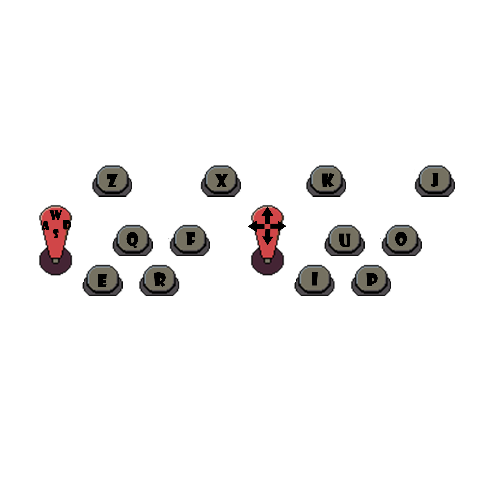

# ArcadeMachine

Arcade Machine now includes a Python game selector for a cabinet-style Java game library.

The launcher is designed to:

- run on Windows for development without touching Linux-only `evdev`
- run on Linux in production and optionally start `controller_to_keyboard.py` with `sudo`
- discover games by folder so the library grows by dropping in new game directories
- show a grid of games with a larger cover image and description for the current selection



## Project Layout

```text
ArcadeMachine/
	launcher.py
	config.py
	controller_bridge.py
	controller_to_keyboard.py
	game_library.py
	config.json
	games/
```

## Game Library Contract

Each game lives in its own folder under `games/`.

```text
games/
	Metal Slug/
		metal_slug.jar
		cover.png
		des.txt
```

- The folder name becomes the display name.
- The launcher expects exactly one `.jar` file.
- `cover.png` is used for the grid card and the detail panel.
- `des.txt` is used for the description panel.

## Windows Development

Install dependencies:

```powershell
python -m pip install -r requirement.txt
```

Run the launcher in windowed mode while developing:

```powershell
python launcher.py --windowed
```

Validate the library and config without opening the UI:

```powershell
python launcher.py --validate
```

## Linux Production

The controller bridge uses `evdev`, `/dev/input`, and `uinput`, so it only runs on Linux and needs elevated privileges.

Start the launcher in production mode from a terminal that can answer a `sudo` prompt:

```bash
ARCADE_PRODUCTION=true python3 launcher.py
```

Do not start `launcher.py` itself with `sudo`. The UI and launched games must run as the desktop user so they inherit the active audio session.

When production mode is enabled on Linux, the launcher starts `controller_to_keyboard.py` as a background subprocess and stops it on shutdown.

## Controls

- Move selection: `WASD` or arrow keys
- Launch game: `Q` or `U`
- Close running game: `Z`
- Refresh library: `F5`
- Exit launcher: `Esc`

## Configuration

Default settings live in `config.json`.

Important values:

- `library_root`: where game folders live
- `fullscreen`: full-screen or windowed display
- `java_command`: command used to launch `.jar` files
- `production_mode`: enables Linux production behavior
- `enable_controller_bridge`: allows the launcher to start `controller_to_keyboard.py`

Environment overrides are also supported:

- `ARCADE_PRODUCTION`
- `ARCADE_LIBRARY_ROOT`
- `ARCADE_FULLSCREEN`
- `ARCADE_WINDOW_WIDTH`
- `ARCADE_WINDOW_HEIGHT`
- `ARCADE_JAVA_COMMAND`
